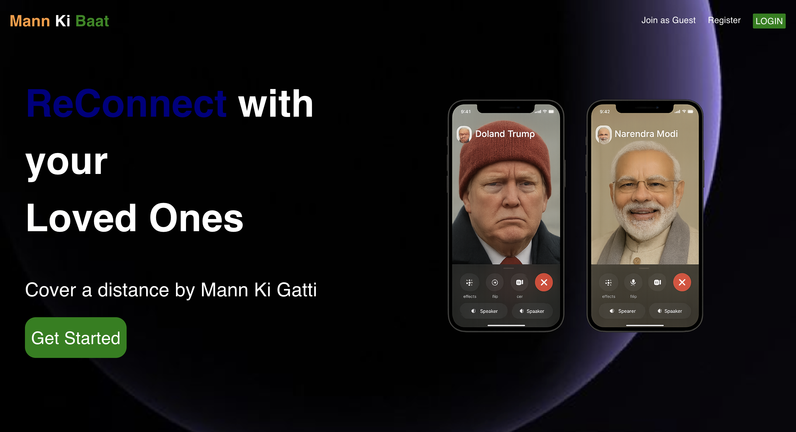
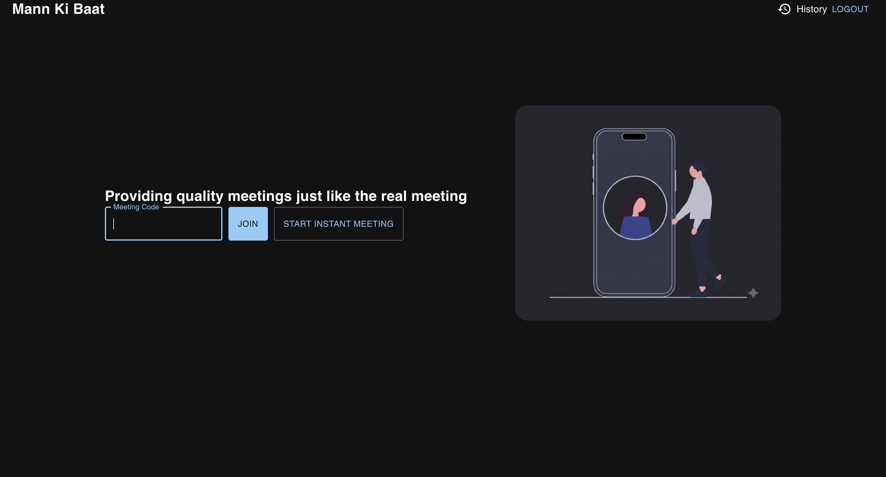
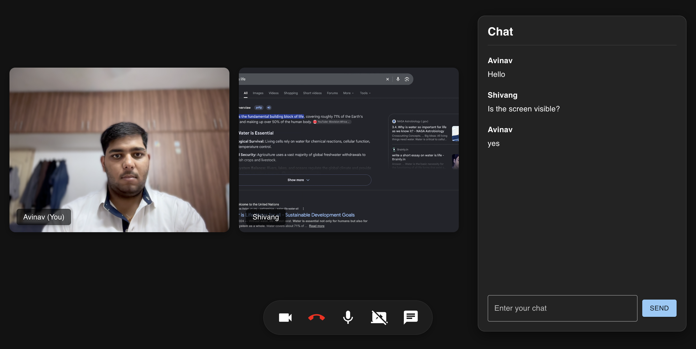

# Mann Ki Baat

A full-stack premium video meeting application built with React, Express, MongoDB, Socket.IO, and WebRTC. Mann Ki Baat lets users register, sign in, create or join meeting rooms, communicate through live audio/video, share screens, exchange chat messages, and review previous meeting activity.

> Built as a real-time collaboration platform with a separate Vite frontend and Node.js backend.

## Preview



<div align="center">
  
  
</div>

## Features

- **Premium Cinematic Dark Theme** across all pages for a cohesive, glare-free viewing experience.
- **Instant Meeting Generation** allowing one-click automatic meeting code creation.
- **Dynamic Meeting Layout** using auto-adjusting CSS Grid that flawlessly wraps participants and prevents chat overlaps.
- **Smart Chat System** featuring unread notification dot badges to prevent UI clutter.
- **Participant Overlays** displaying names under video feeds (like Google Meet) for clear identification.
- **Camera-Off Avatars** dynamically replacing disabled video streams with sleek Material UI icons instead of blank screens.
- User registration and login with hashed passwords.
- Join meetings using custom meeting codes or history links.
- WebRTC-powered peer-to-peer audio and video calls with Mesh topology.
- Socket.IO signaling for real-time meeting coordination.
- Meeting activity history tracking stored securely in MongoDB.
- Seamless navigation shortcuts and interactive branding routing.

## Tech Stack

| Layer | Technologies |
| --- | --- |
| Frontend | React 19, Vite, React Router, Material UI, Axios, Socket.IO Client |
| Backend | Node.js, Express 5, Socket.IO, Mongoose |
| Database | MongoDB |
| Realtime | WebRTC, Socket.IO |
| Auth | bcrypt password hashing, generated session tokens |

## Project Structure

```text
Meeting/
├── FRONTEND/
│   ├── public/
│   ├── src/
│   │   ├── contexts/
│   │   ├── pages/
│   │   ├── styles/
│   │   ├── utils/
│   │   ├── App.jsx
│   │   └── main.jsx
│   ├── package.json
│   └── vite.config.js
├── BACKEND/
│   ├── src/
│   │   ├── controllers/
│   │   ├── models/
│   │   ├── routes/
│   │   └── app.js
│   └── package.json
└── README.md
```

## Getting Started

### Prerequisites

- Node.js 18 or newer
- npm
- MongoDB Atlas account or a local MongoDB instance
- Modern browser with camera, microphone, and WebRTC support

### Installation

Clone the repository and install dependencies for both applications.

```bash
git clone <your-repository-url>
cd Meeting

cd BACKEND
npm install

cd ../FRONTEND
npm install
```

### Environment Variables

For production-quality setup, keep secrets outside source code.

Create `BACKEND/.env`:

```env
PORT=8000
MONGODB_URI=mongodb+srv://<username>:<password>@<cluster-url>/<database-name>
CLIENT_URL=http://localhost:5173
```

## Running Locally

Start the backend server:

```bash
cd BACKEND
npm run dev
```

The backend runs on:

```text
http://localhost:8000
```

Start the frontend development server:

```bash
cd FRONTEND
npm run dev
```

The frontend runs on:

```text
http://localhost:5173
```

Open the frontend URL in your browser, register a user, log in, and join a meeting code.

## Available Scripts

### Frontend

| Command | Description |
| --- | --- |
| `npm run dev` | Start the Vite development server |
| `npm run build` | Create a production build |
| `npm run preview` | Preview the production build locally |
| `npm run lint` | Run ESLint |

### Backend

| Command | Description |
| --- | --- |
| `npm run dev` | Start the backend with Nodemon |
| `npm start` | Start the backend with Node |
| `npm run prod` | Start the backend with PM2 |

## Application Routes

| Route | Description |
| --- | --- |
| `/` | Landing page |
| `/auth` | Login and registration page |
| `/home` | Authenticated dashboard for joining meetings |
| `/history` | User meeting history |
| `/:url` | Dynamic video meeting room |

## API Endpoints

Base URL:

```text
http://localhost:8000/api/v1/users
```

| Method | Endpoint | Description |
| --- | --- | --- |
| `POST` | `/register` | Register a new user |
| `POST` | `/login` | Authenticate user and return a session token |
| `POST` | `/add_to_activity` | Save a meeting code to user history |
| `GET` | `/get_all_activity` | Fetch meeting history for a user |

## Realtime Events

The backend uses Socket.IO to coordinate WebRTC connections and meeting chat.

| Event | Direction | Purpose |
| --- | --- | --- |
| `join-call` | Client to server | Join a meeting room with username tracking |
| `user-joined` | Server to client | Notify participants and sync username & camera states |
| `user-left` | Server to client | Notify participants when a user leaves |
| `camera-toggle`| Client to server | Broadcast when a user mutes their camera feed |
| `signal` | Both | Exchange WebRTC SDP and ICE candidate data |
| `chat-message` | Both | Send and receive meeting chat messages |

## Security Notes

- The MongoDB `.env` file must be ignored via `.gitignore`.
- Restrict Socket.IO CORS origins in production.
- Use HTTPS in production because camera, microphone, and screen sharing APIs require secure origins outside localhost.

## Deployment Notes

- Deploy the backend to a Node.js hosting platform such as Render, Railway, Fly.io, or a VPS (NOT Vercel Serverless due to WebSockets).
- Deploy the frontend to Vercel, Netlify, or any static hosting provider.
- Configure frontend API and Socket URL paths in the production code to point to the deployed backend.
- Configure backend CORS to allow only the deployed frontend URL.

## Author

Developed by Avinav Kumar.
