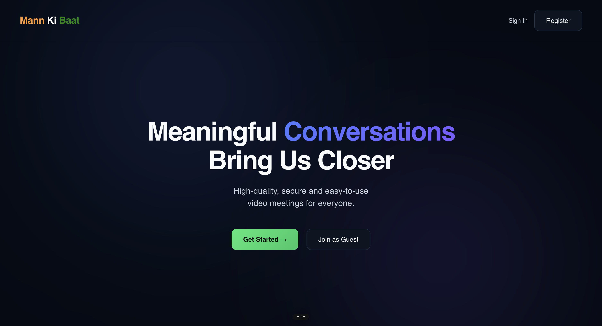
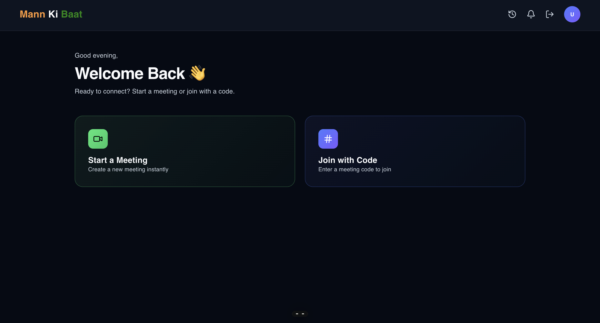
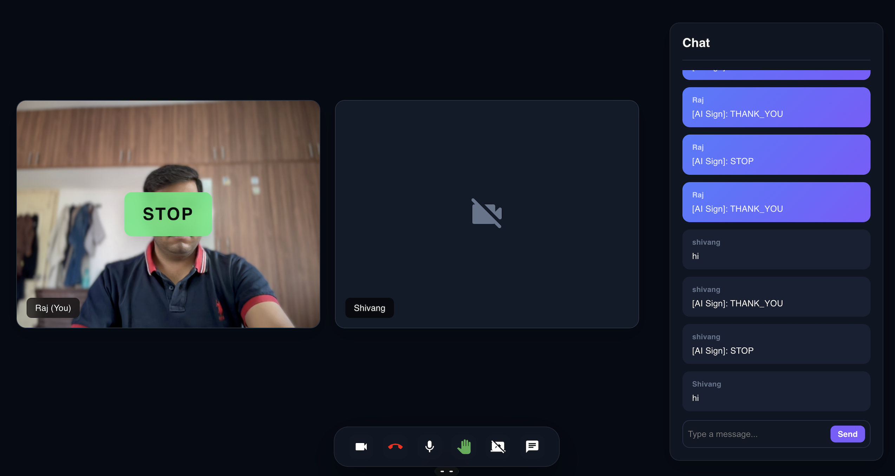

# Mann Ki Baat

A full-stack, AI-powered premium video meeting application built with React, Node.js, WebRTC, and TensorFlow.js. Mann Ki Baat lets users communicate through live audio/video, share screens, exchange chat messages, and features a completely **in-browser AI Sign Language Recognition** engine to broadcast hand gestures as text for muted or non-verbal participants.

> Built as an accessibility-first real-time collaboration platform with a separate Vite frontend, Node.js backend, and isolated ML training pipeline.

## Preview



<div align="center">
  
  
</div>

## Features

- **AI Sign Language Translation (New!):** Fully local, privacy-first AI pipeline that tracks 21 hand landmarks using MediaPipe, processes them through a custom TensorFlow.js neural network, and translates sign language into text broadcasts in real-time. Includes temporal smoothing (debouncing) for high accuracy.
- **Premium SaaS UI/UX (New!):** Completely overhauled design system featuring a deep navy palette, frosted glassmorphism cards, glowing gradients, smooth animations, and crisp Inter typography.
- **Dynamic Meeting Layout:** Auto-adjusting CSS Grid that flawlessly wraps video tiles and features a sleek right-side chat panel.
- **Instant Meeting Generation:** One-click automatic meeting code creation and joining.
- **Participant Overlays:** Floating name tags and smart "Camera-Off" fallback avatars on video tiles.
- **Real-Time Communication:** WebRTC-powered peer-to-peer audio and video calls, plus screen sharing and Socket.IO chat.
- **Secure Authentication & History:** User registration, hashed passwords, and meeting history tracking stored in MongoDB.

## Tech Stack

| Layer | Technologies |
| --- | --- |
| **Frontend UI** | React 19, Vite, React Router, Lucide React, Framer Motion |
| **AI / Machine Learning** | MediaPipe Hand Landmarker, TensorFlow.js (TF.js) |
| **Backend & Auth** | Node.js, Express 5, Mongoose, MongoDB, bcrypt |
| **Realtime / Comms** | WebRTC (Mesh topology), Socket.IO Client & Server |

## Project Structure

```text
Meeting/
├── FRONTEND/
│   ├── public/
│   │   └── model/              # Trained AI TF.js Model JSON/Weights
│   ├── src/
│   │   ├── components/
│   │   ├── pages/              # Landing, Home, Auth, VideoMeet
│   │   ├── styles/             # Global Tokens, CSS Modules
│   │   └── utils/
│   │       ├── signRecognizer.js     # AI Inference Engine
│   │       └── landmarkPreprocess.js # 3D vector normalization
│   └── package.json
├── BACKEND/
│   ├── src/
│   │   ├── controllers/
│   │   ├── models/
│   │   ├── routes/
│   │   └── SocketManager.js    # WebRTC Signaling & Chat
│   └── package.json
├── ML_PIPELINE/                # Offline Data Collection & Training
│   ├── data_collector.html     # Browser-based dataset recorder
│   └── train_model.js          # TF.js Model Builder & Trainer
├── PROJECT_DOCS.md             # Comprehensive Architecture Specs
└── README.md
```

## Getting Started

### Prerequisites
- Node.js 18 or newer
- npm
- MongoDB Atlas account or a local MongoDB instance
- Modern browser with camera, microphone, and WebRTC support

### Installation

Clone the repository and install dependencies for both applications.

```bash
git clone <your-repository-url>
cd Meeting

cd BACKEND
npm install

cd ../FRONTEND
npm install
```

### Environment Variables

Create `BACKEND/.env`:

```env
PORT=8000
MONGODB_URI=mongodb+srv://<username>:<password>@<cluster-url>/<database-name>
CLIENT_URL=http://localhost:5173
```

## Running Locally

Start the backend server (Terminal 1):
```bash
cd BACKEND
npm run dev
# Runs on http://localhost:8000
```

Start the frontend development server (Terminal 2):
```bash
cd FRONTEND
npm run dev
# Runs on http://localhost:5173
```

## AI Pipeline Details
The AI feature is designed for maximum privacy and zero latency. No video frames are ever sent to a server.
1. The local camera feed is passed to **MediaPipe** (WASM) running in the browser.
2. 21 3D hand coordinates are extracted.
3. Coordinates are mathematically normalized relative to the wrist to ensure scale and position invariance.
4. The **TensorFlow.js** Sequential Neural Network classifies the gesture.
5. If the same gesture is held confidently for 5 consecutive frames, it is broadcast to the meeting via **Socket.IO**.

## Deployment Notes
- Deploy the backend to a Node.js hosting platform such as Render, Railway, Fly.io, or a VPS (NOT Vercel Serverless due to WebSockets).
- Deploy the frontend to Vercel, Netlify, or any static hosting provider.
- Configure frontend API and Socket URL paths in the production code to point to the deployed backend.

## Author
Developed by Avinav Kumar.
